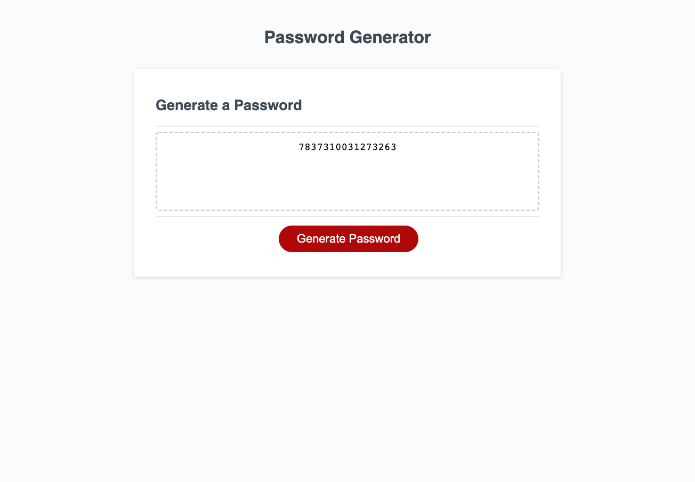

# HW3-Password-Generator

This is a password generator that allows the user to created a password with a length between 8 and 128 characters. The user is able to choose whether or not they would like to include, numbers, lowercase letters, uppercase letters, and/or special characters in their password. After they make these choices, the generator  will give them a random password containing the criteria the chose for their password.

**Link to Webpage**

https://mkimborowicz.github.io/HW3-Password-Generator/

**Screenshot of Webpage**

Example of 15 character password generated with only numbers:

